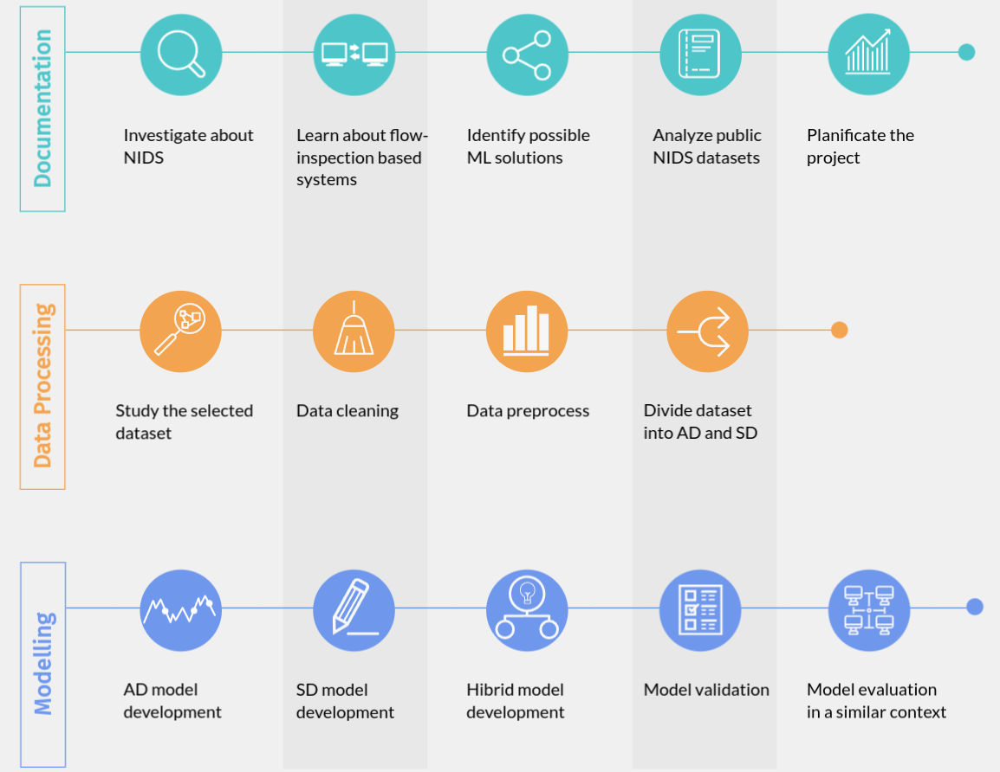
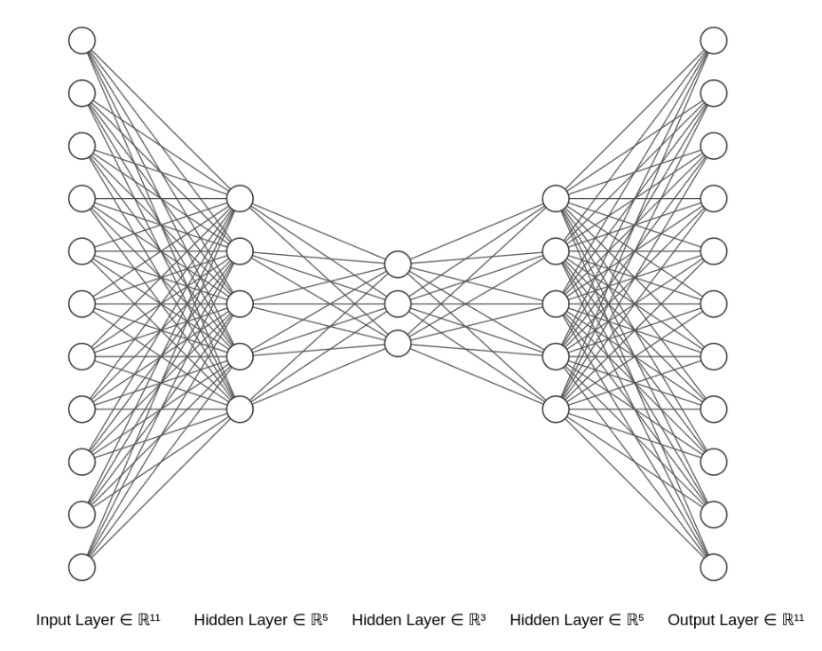
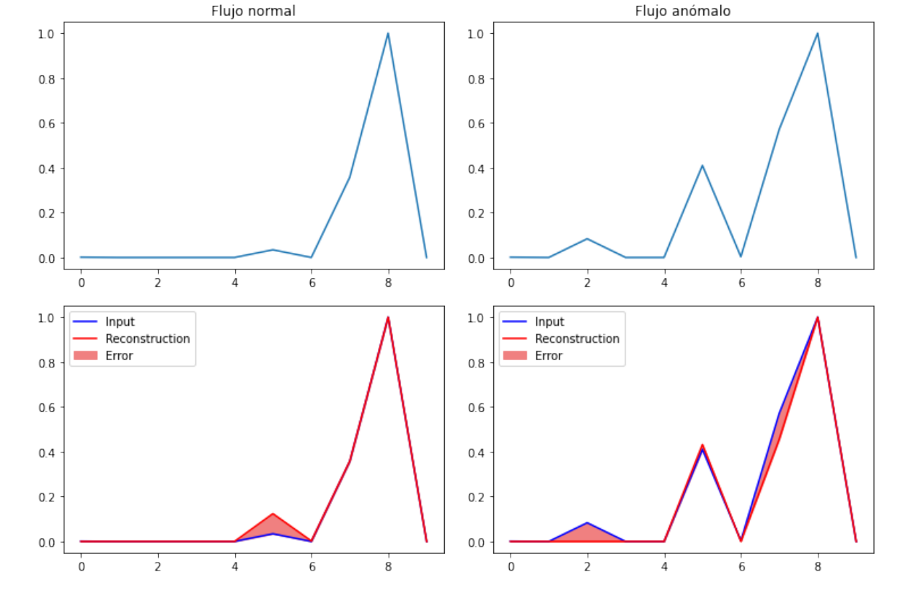
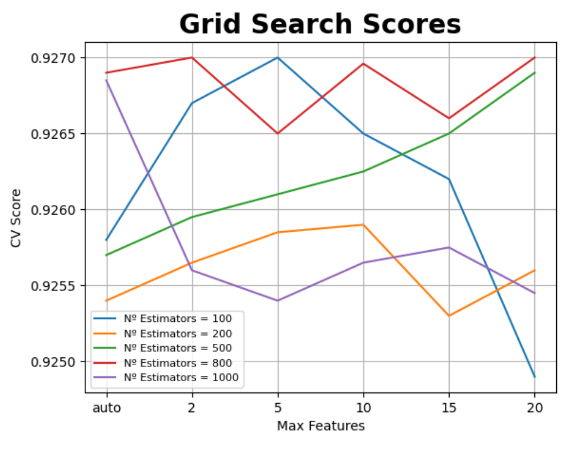
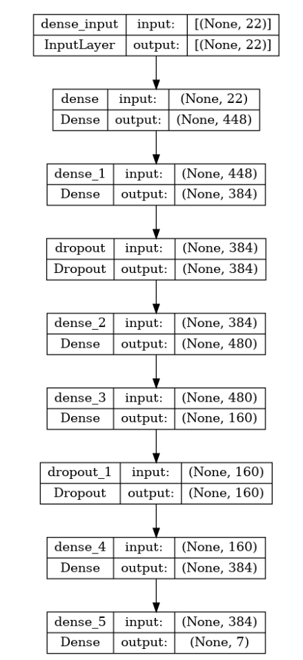
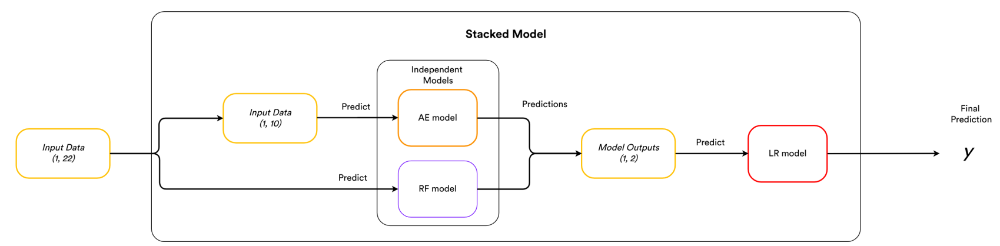
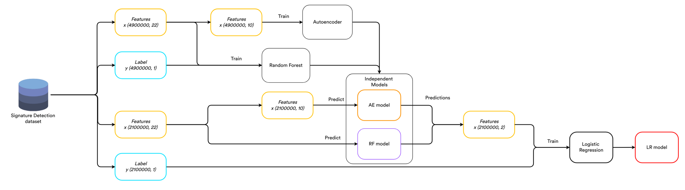

# Evaluación de las diferentes técnicas de Network Intrusion Detection (NIDS)

## :hammer: Estructura del proyecto

El proyecto se encuentra estructurado en seis iteraciones, una por cada fase realizada en la metodología. La estructura del proyecto es la siguiente:

``` bash
Network-Intrusion-Detection-System.git
├── 1 - Exploración de los datos
│   ├── 1 - Descripcion del conjunto.ipynb
│   ├── 2 - Descripción de atributos.ipynb
│   └── 3 - Correlaciones.ipynb
├── 2 - Preprocesado
│   ├── 1 - Preprocess-Multiclass.ipynb
│   ├── 2 - Preprocess-AD.ipynb
│   ├── 3 - SD-Preprocess.ipynb
│   └── 4 - Balanced-Multiclass.ipynb
├── 3 - Anomaly Detection
│   ├── AE-Hyper-Test.ipynb
│   ├── AE.ipynb
│   └── IF.ipynb
├── 4 - Signature Detection
│   ├── dnn-hyper.py
│   ├── FFNN-Hyper.ipynb
│   ├── RF-Hyper.ipynb
│   └── rf-hyper.py
├── 5 - Hybrid Detection
│   └── Hybrid.ipynb
├── 6 - Evaluacion
│   ├── Autoencoder-Eval.ipynb
│   ├── CIC-IDS-2017-Preprocess.ipynb
│   ├── FFNN-Eval.ipynb
│   ├── RF-Eval.ipynb
│   └── Stacked-Eval.ipynb
├── images
│   ├── ae.png
│   ├── dnn.png
│   ├── flujos.png
│   ├── hybrid.png
│   ├── rf.png
│   └── train.png
├── LICENSE
└── README.md
```

## :rocket: Roadmap

Para establecer la planificación temporal para las diferentes fases del proyecto, se decidió no comprometerse con ninguna metodología en concreto. Esto se debe a que la aplicación de metodologías de desarrollo ágiles, como Scrum, no se ajustaba al desarrollo de las fases. Por ello se decidió utilizar un marco personalizado, inspirado en características de diferentes metodologías de desarrollo ágiles. A continuación se muestra a grandes rasgos las diferentes fases realizadas:

<center>

</center>
<br>

## :books: Introducción

Una de las primeras líneas de defensa de las organizaciones para detectar las posibles intrusiones en sus redes son los **NIDS** (*Network Intrusion Detection Systems*). En un intento de detectar ataques o comportamientos inusuales, estos sistemas tradicionalmente, inspeccionaban el contenido de cada paquete (el *payload*). Sin embargo, debido al gran aumento de tráfico en las redes de comunicaciones junto con el incremento y evolución de los ciberataques han levado a la introducción de estrategias más avanzadas como la detección de anomalías mediante el paradigma de **inspección basado en flujos** y **aprendizaje automático**.

En este proyecto se presentan diferentes técnicas para la detección de anomalías en flujos de red. Para ello se utilizó un dataset etiquetado, el **CSE-CIC-IDS-2018**, sobre el cual se realizaron diferentes fases de exploración y preprocesado para facilitar el aprendizaje de los modelos. Las técnicas utilizadas pueden agruparse según la metodología de inspección para los NIDS: 

 * Técnicas de **Detección de Anomalías** (AD): genera un "perfil normal" de la red y se basa en comparar este con los eventos observados para reconocer anomalías.
 * Técnicas de **Detección de Firmas** (SD): se basa en comparar los patrones de red capturados con ataques previeamente conocidos.
 * Técnicas **Híbridas**: utilizan una combinación de las anteriores para proporcionar una detección más amplia y precisa.

### :globe_with_meridians: Flujos de red

Una opción que actualmente atrae la atención de investigadores y operadores es la generación de flujos de red para la detección de intrusiones. Con este enfoque, se analizan los patrones de comunicación dentro de la red, en lugar del contenido de los paquetes individuales. Estos sistemas exportan esta información en forma de registros Netflow o IPFIX a sistemas que los analizan. Estos métodos de análisis pueden utilizarse para detectar intrusiones en las redes.

En la literatura, se pueden encontrar varias definiciones de un flujo de red. En este proyecto se tomó la definición de flujo IP descrita por el grupo de trabajo IPFIX (*IP Flow Information Export*) dentro del IETF: ”*Un flujo se define como un conjunto de paquetes IP que pasan por un punto de observación en la red durante un determinado intervalo de tiempo. Todos los paquetes que pertenecen a un flujo particular tienen un conjunto de propiedades comunes*”.

### :closed_book: Aprendizaje automático

El aprendizaje automático (ML) es el proceso mediante el cual se usan modelos matemáticos de datos para ayudar a una máquina a aprender sin instrucciones directas. El aprendizaje automático usa algoritmos para identificar patrones en los datos, y esos patrones luego se usan para crear un modelo de datos que pueda hacer predicciones. Con más experiencia y datos, los resultados del aprendizaje automático son más precisos, de forma muy similar a cómo los humanos mejoran con más práctica.

A continuación se introducen las diferentes técnicas empleadas en el proyecto en materia de detección de intrusiones:

 * (AD): ***Isolation Forest*** (IF), ***Autoencoders*** (AE).
 * (SD): ***Random Forest*** (RF), ***Deep Neural Network*** (DNN).
 * Técnicas Híbridas: *stacking* de los modelos ***Random Forest***, ***Autoencoder*** y ***Logistic Regression***.


## :computer: CSE-CIC-IDS-2018

Los conjuntos de datos CIC-IDS-2017 y CSE-CIC-IDS-2018 han utilizado el concepto de perfiles para generar los conjuntos de datos de forma ordenada y presentan un conocimiento profundo de los ataques realizados y sobre el conocimiento conceptual sobre los diferentes modelos de aplicación, dispositivos de red y protocolos. El tráfico de la red se capturó utilizando el CICFlowMeter que asigna una etiqueta al flujo y también da detalles sobre la dirección y el número de puerto de origen y destino, la marca de tiempo y el ataque. Las simulaciones del entorno de pruebas consisten en tráfico de red generado a partir de protocolos como HTTP, HTTPS, SSH, y protocolos de correo electrónico como SMTP y POP3.

<center>

</center>
<br>


El CSE-CIC-IDS2018 se preparó a partir de una red de clientes-objetivo y máquinas de ataque simuladas, lo que dio como resultado un conjunto de datos que contiene 16.233.002 instancias recogidas de 10 días de tráfico de red. Alrededor del 17% de las instancias es tráfico de ataque. En cuanto a los ataques, se consideraron seis escenarios diferentes mostrados en el siguiente cuadro.

**Attack** | **Tools** | **Duration** | **Attacker** | **Victim** 
--- | --- | --- | --- |---  
**Bruteforce attack** | FTP – Patator, SSH – Patator | One Day | Kali Linux | Ubuntu 16.4 (Web Server)
**DoS attack** | Hulk, GoldenEye, Slowloris, Slowhttptest | One Day | Kali Linux | Ubuntu 16.4 (Apache)
**DoS attack** | Heartleech | One Day | Kali Linux | Ubuntu 16.4 (OpenSSL)
**Web attack** | Damn Vulnerable Web App (DVWA),In house selenium framework (XSS and Brute-force) | Two Day | Kali Linux | Ubuntu 16.4 (Web Server)
**Infiltration attack** | First level: Dropbox download in a windows machine. Second Level: Nmap and portscan. | Two Day | Kali Linux | Windows Vista and Macintosh
**Botnet attack** | Ares (developed by Python): remote shell, file upload/download, capturing, screenshots and key logging. | One Day | Kali Linux | Windows Vista, 7, 8.1, 10 (32-bit) and 10 (64-bit)
**DDoS+PortScan** | Low Orbit Ion Canon (LOIC) for UDP, TCP, or HTTP requests. | Two Day | Kali Linux | Windows Vista, 7, 8.1, 10 (32-bit) and 10 (64-bit)

El conjunto de datos **CSE-CIC-IDS-2018** contiene **80 características**. Este conjunto de datos contiene flujos bidireccionales (Biflow), donde el primer paquete determina las direcciones hacia adelante (origen a destino) y hacia atrás (destino a origen), por lo que las características estadísticas como Duración, Número de paquetes, Número de bytes, Longitud de los paquetes, etc. también se calculan por separado en la dirección hacia adelante y hacia atrás.

## :bar_chart: Procesado de los datos

Para el conjunto de datos CSE-CIC-IDS-2018 se realizó una limpieza de datos básica (sustracción de atributos nulos, corruptos, erróneos, valores atípicos, etc.). A partir de este punto para cada metodología se utilizaron técnicas de preprocesado diferentes, dejándonos con dos conjuntos de datos: un conjunto para SD y otro conjunto para AD.

Partiendo del **conjunto de detección de firmas**, se analizan las correlaciones con la variable objetivo. El conjunto de datos analizado cuenta con 40 características, de las cuales se eliminarán las que tengan una baja correlación, siempre y cuando no contengan una correlación muy alta para ataques individuales. Con ello se consigue un conjunto de datos de 22 atributos. Posteriormente, a este conjunto se le aplica un rebalanceo de clases mediante la aplicación de técnicas de **SMOTE** y **Random Undersampling**. A continuación se muestra un ejemplo de flujo después del preprocesado:

**Dst Port** | **xhr** | **Fwd Pkt Len Max** | **Fwd Pkt Len Min** | **Fwd Pkt Len Mean** | **Bwd Pkt Len Min** | **Bwd Pkt Len Mean** | **Bwd IAT Tot** | **Bwd IAT Mean** | **Bwd IAT Max** | **Fwd PSH Flags** | **Fwd Pkts/s** | **Bwd Pkts/s** | **RST Flag Cnt** | **PSH Flag Cnt** | **ACK Flag Cnt** | **Init Fwd Win Bytes** | **Init Bwd Win Bytes** | **Fwd Seg Size Min** | **Idle Min** | **Protocol_6** | **Protocol_17**
--- | --- | --- | --- | --- | --- | --- | --- | --- | --- | --- | --- | --- | --- | --- | --- | --- | --- | --- | --- | --- | ---  
0.00676 | 0.258819 | 0.096901 | 0.0 | 0.027307 | 0.0 | 0.446976 | 0.000594 | 0.000676 | 0.000957 | 0.0 | 2.624249e-07 | 6.997997e-07 | 1.0 | 1.0 | 0.0 | 0.125015 | 0.01445 | 0.357143 | 0.054542 | 1.0 | 0.0

Para el **conjunto de detección de anomalías** se siguió el mismo enfoque. Se analizaron las correlaciones de los atributos con la variable de salida y las individuales para cada ataque. De esta manera se eliminaron las características con una correlación absoluta baja que no fuesen cruciales para la detección de ataques individuales. A continuación se muestra un flujo del dataset anterior después del preprocesado:

**Dst Port** | **Fwd Pkt Len Min** | **Fwd Pkt Len Mean** | **Bwd Pkt Len Min** | **Bwd Pkts/s** | **Init Fwd Win Bytes** | **Init Bwd Win Bytes** | **Fwd Seg Size Min** | **Protocol_6** | **Protocol_17**
--- | --- | --- | --- | --- | --- | --- | --- | --- | ---
0.00032 | 0.0 | 0.0 | 0.0 | 0.025 | 0.410217 | 0.000015 | 0.714286 | 1.0 | 0.0


## :bulb: Modelos empleados

Para realizar la hiperparametrización de los modelos, en el proyecto se utilizó la técnica de ***Grid Search*** (fuerza bruta con todas las combinaciones de parámetros). En las técnicas de árboles se aplicó mediante la librería GridSearchCV y en las redes neuronales con la libería de KerasTuner. En ambas técnicas se aplica una ***stratified 3-fold cross-validation*** evitando que una partición fortuita en los datos afecte al resultado.

Para esta fase de hiperparametrización se aplicó un conjunto de datos reducido escala de 1:10 para todas las clases para reducir el tiempo de búsqueda.

### :one: Isolation Forest

Esta técnica se ha entrenado de manera semi-supervisada, introduciendo un valor de threshold en la puntuación de anomalías para separar las clases. En general, IF es una técnica robusta a la parametrización.

Dichos parámetros a configurar son:
* Número de ejemplos: el número de muestras a extraer de X para entrenar cada estimador base. Se utilizaron valores de 0,1 a 1 en intervalos de 0,1. El mejor valor para este atributo es 0,6.
* Número de árboles: número de estimadores base para la técnica. Se utilizaron valores desde 20 a 230 en intervalos de 30. El mejor valor para este atributo es 110.
* Contaminación: proporción de valores atípicos en el conjunto de datos. Se introduce el porcentaje de anomalías del conjunto, en este caso, un 60%.

El motivo por el que tan solo se realizó una pequeña aproximación para hacer la separación entre tráfico normal y DoS, es que las siguientes técnicas, los *Autoencoders*, obtuvieron precisiones abrumadoramente superiores para el mismo problema.

### :two: Autoencoders

Estas técnicas están formadas por dos redes neuronales, unidas por una capa oculta. Por lo tanto, los parámetros para modificar para cada red son los siguientes:
* Número de capas ocultas: número de capas de la red. Oscilan entre los valores 1 y 4.
* Neuronas por capa: nodos en cada capa de la red. A medida que aumenta el nivel de capa, decrece este valor, dependiendo del vector de entrada.
* Algoritmo de optimización: se eligió el algoritmo ’Adam’, haciendo que sus valores oscilen entre 0,01, 0,001, y 0,0001.

Para controlar el sobreajuste, se utiliza una función de early-stopping, que para el entrenamiento cuando el error de reconstrucción de la red no mejora en 10 ’epoches’. A continuación se muestra la arquitectura utilizada para el Autoencoder utilizando la librería Keras.

<center>

</center>
<br>

En el contexto de ***Anomaly Detection*** se entrena un autoencoder sólo con los flujos normales y luego se utilizará para reconstruir todos los datos. La hipótesis es que los flujos anómalos tendrán un mayor error de reconstrucción. Se clasificará un flujo como anómalo si el error de reconstrucción supera un umbral fijo, definido previamente, o basado en estadísticas de los flujos.

<center>

</center>
<br>


Se puede apreciar que los valores de reconstrucción para los flujos anómalos tienen un error ligeramente superior a los flujos normales. Este error se utilizará para categorizar los datos en anomalías.

### :three: Random Forest

Los parámetros a configurar en esta técnica son:
* Número máximo de atributos: es el número de características que se pueden utilizar en cada partición. Oscila entre los valores 2 y 20. El valor seleccionado para este atributo fue 5.
* Número de árboles: número de árboles totales. Se probaron valores entre 100 y 1000. El mejor valor para esta característica es 100.

A continuación se muestra en la figura 6.17 una gráfica en donde en el eje ’y’ se encuentran las precisiones obtenidas según el número de árboles y atributos. En el eje ’x’ corresponde a los diferentes valores de ’Max Features’. Y las diferentes líneas representan los valores de ’No
Estimators’.

<center>

</center>
<br>

Se puede observar como hay tres combinaciones que obtienen precisiones muy similares. Estas combinaciones fueron (No Estimators = 800, Max Features = 2), (No Estimators = 100, Max Features = 5) y (No Estimators = 800, Max Features = 20). Entre estas, se han elegido los valores (No Estimators = 100, Max Features = 5) por ser los que menor complejidad otorgaban al árbol.

### :four: Deep Neural Network
Las técnicas de DNN tienen los mismos parámetros para configurar que los autoencoders. También se controla el sobreajuste con una función de early-stopping. La arquitectura resultante se muestra a continuación.

<center>

</center>
<br>

### :five: Detección Híbrida

A continuación se propone un sistema que combine las salidas de los modelos desarrollados en los apartados anteriores. Los modelos seleccionados de cada método fueron el *Autoencoder* y el *Random Forest*.

En este caso, para realizar la combinación de los modelos se ha utilizado una estrategia de ***Stacking***. La idea general es que hay diversas capas (o niveles) de clasificadores y cada capa utiliza los resultados obtenidos por la anterior. La última capa está formada por un único clasificador que es el que toma la decisión final. El funcionamiento deseado es bastante intuitivo:



Cada flujo ya preprocesado (22 características) se toma como input en los dos modelos, con la diferencia de que el AE realiza una etapa más de preprocesado en la cual elimina 12 características del flujo de entrada. Después, ambos modelos realizan su predicción sobre el flujo introducido, las cuales se tomarán como entrada para el modelo final. Este será el que determine si el flujo introducido es una anomalía.

Cuando se utilizan técnicas de *stacking*/*ensembling*, es muy importante que el metamodelo sea entrenado en un conjunto de datos distinto al utilizado para entrenar los modelos base. Esto se debe a que este **clasificador final** intenta **corregir los sesgos** de los clasificadores de nivel cero. Para ello se utilizó un *stratified holdout*, de manera que las proporciones entre las clases no varíen al dividir el conjunto.

Para realizar el proceso de entrenamiento, al modelo se le entrega un conjunto de datos (en este caso se utilizó el conjunto de *Signature Detection*). Posteriormente se le aplica un *stratified holdout* con proporción 2/3 para los modelos base y 1/3 para el modelo final. Los modelos base se entrenan con el conjunto de datos de entrenamiento normal y el modelo final se entrena con las predicciones de los modelos base.



## :page_with_curl: Resultados

Para realizar la evaluación de los diferentes modelos se han empleado dos datasets, el CSE-CIC-IDS-2018 y el CIC-IDS-2017, en aras de comprobar que los modelos son aplicables en dominios similares. El contenido de ambos es relativamente similar, aunque no idéntico, ya que existen pequeñas diferencias en los ataques realizados, protocolos y atributos generados.

### Evaluación con CSE-CIC-IDS-2018

**Técnicas** | **Normal** | **DoS** | **DDoS** | **Bot** | **Fuerza Bruta** | **Infiltración** | **Web** 
--- | --- | --- | --- | --- | --- | --- | ---
**IF** | 62.6% | 78.9% | NA | NA | NA | NA | NA 
**AE** | 69.9% | 99.8% | 54.3% | 49.6% | 100% | 27.7% | 61%
**RF** | 88.4% | 78.9% | 99.9% | 99.9% | 91.8% | 58.9% | 98.6%
**DNN** | 98.4% | 99.8% | 98% | 99.9% | 90.7% | 29.8% | 98.8%
**Hybrid** | 96.4% | 100% | 100% | 99.9% | 100% | 39.6% | 98.2%

### Evaluación con CIC-IDS-2017

**Técnicas** | **Normal** | **DoS** | **DDoS** | **Bot** | **Fuerza Bruta** | **Infiltración** | **Web** 
--- | --- | --- | --- | --- | --- | --- | ---
**IF** | NA | NA | NA | NA | NA | NA | NA 
**AE** | 69.4% | 63.6% | 99.9% | 62% | 50.9% | 33.3% | 90.9%
**RF** | 99% | 99.9% | 99.9% | 98.6% | 100% | 66.7% | 98.6%
**DNN** | 95.6% | 99.8% | 99.7% | 98.9% | 99.9% | 66.7% | 98.9%
**Hybrid** | 99% | 99.9% | 99.9% | 98.9% | 100% | 77.7% | 98.6%

El modelo híbrido tiene una superioridad muy notoria frente al resto y es la capacidad de poder detectar nuevas amenazas con alta precisión debido a la combinación de las diferentes metodologías. Cabe destacar que al desarrollar un IDS, las organizaciones suelen optar por una combinación de AD y SD. Esto se debe que a la hora de detectar amenazas en el mundo real, funcionan mucho mejor estas técnicas combinadas que por separado. Por lo tanto, el modelo Híbrido se presenta como la técnica ganadora.

## :office: Escenarios de ataques

Estan implementados **siete** escenarios de ataque. Para cada ataque, se define un escenario basado en la topología de red implementada y se ejecuta el ataque desde una o más máquinas fuera de la red objetivo. Para tener una diversidad de máquinas similar a las redes del mundo real, se han instalado **5 subredes**: el departamento de I+D (Dep1), el departamento de gestión (Dep2), el departamento técnico (Dep3), el departamento de secretaría y operaciones (Dep4), el departamento de TI (Dep5) y las salas de servidores. Para todos los departamentos, excepto el departamento de TI, se han instalado conjuntos de diferentes sistemas operativos MS Windows (Windows 8.1 y Windows 10) y todos los ordenadores del departamento de TI son Ubuntu. Para la sala de servidores, se han implementado diferentes servidores MS Windows como 2012 y 2016.

### :punch: Brute-force

Un ataque de fuerza bruta es un intento de descifrar una contraseña o nombre de usuario, de buscar una página web oculta o de descubrir la clave utilizada para cifrar un mensaje, que consiste en aplicar el método de **prueba y error** con la esperanza de dar con la combinación correcta. Una de las herramientas más completas para este propósito es **Patator**, en el conjunto se utiliza para realizar **ataques sobre FTP y SSH** en la máquina Kali Linux y un sistema Ubuntu 14.0 como máquina víctima. Para la lista de contraseñas, se utilizó un gran diccionario que contiene 90 millones de palabras.

### :broken_heart: Heartbleed

Heartbleed es una vulnerabilidad en la librería criptográfica de **OpenSSL**. Esta vulnerabilidad permite a cualquiera en Internet **leer la memoria** de los sistemas protegidos por las versiones vulnerables del software OpenSSL. Una de las herramientas más famosas para explotar Heartbleed es **Heartleech**. Puede escanear sistemas vulnerables y luego puede utilizarse para explotarlos y exfiltrar datos.


### :space_invader: Botnet

Una botnet o red zombi es un **grupo de ordenadores** o dispositivos que están **bajo el control de un atacante**, y que se usan para perpetrar actividades malintencionadas contra una víctima. En este conjunto de datos se utilizó **Zeus**, que es un paquete de malware troyano que se ejecuta en versiones de Microsoft Windows. Zeus se propaga principalmente a través de drive-by downloads y esquemas de phishing. Además, como complemento se utiliza la botnet Ares, que es una botnet de código abierto con shell remoto cmd.exe, persistencia, carga/descarga de archivos, etc. 

En este escenario, se han infectado máquinas con dos botnets diferentes (Zeus y Ares), además cada 400 segundos se solicitan capturas de pantalla a los zombis.


### :no_entry: Denial-of-Service

Un ataque de denegación de servicio o DoS (de sus siglas en inglés, Denial of Service), es un tipo de ataque informático que persigue que un sistema de ordenadores, un servicio o recurso, sea **inaccesible** a los usuarios legítimos. El ataque de denegación de servicio normalmente busca la pérdida de la conectividad con la red donde se encuentran estos recursos, bien por un consumo excesivo del ancho de banda o sobrecarga del sistema atacado.

### :name_badge: Distributed Denial-of-Service

Una amplificación del ataque DoS, son los ataques de denegación de servicio distribuidos, DDoS (en inglés, Distributed Denial of Service) el cual se lleva a cabo generando un **gran flujo de tráfico** desde **varios puntos de conexión** hacia un mismo punto de destino (víctima).

### :syringe: Web Attacks

Se utiliza Damn Vulnerable Web App (DVWA) para realizar los ataques web. DVWA es una **aplicación web PHP/MySQL** vulnerable. Para automatizar los ataques en la sección de **XSS**, **SQLi** y **fuerza bruta** se ha desarrollado un código de automatización con el framework Selenium.

### :japanese_goblin: Infiltration of the network from inside

En este escenario, se explota una aplicación vulnerable (como Adobe Acrobat Reader 9). Primero la víctima recibe un documento malicioso a través del correo electrónico. Luego, después de una explotación exitosa usando el framework Metasploit, se ejecutó un **backdoor** en el ordenador de la víctima. Lo que permitió llevar a cabo diferentes **ataques en la red** de la víctima, incluyendo el **barrido de IP**, el **escaneo de puertos** y la **enumeración de servicios** utilizando Nmap.

### :wrench: Herramientas para la realización de los ataques

#### Brute-Force Patator

Brute-Force Patator es un *brute-forcer* multipropósito, con un diseño modular y un uso flexible. Patator es una herramienta multihilo escrita en Python, que se esfuerza por ser más fiable y flexible que sus predecesores (Hydra, Medusa, etc). Ofrece modulos desde login de ftp, ssh, telnet, etc. hasta ataques de enumeración de DNS o usuarios de correo electrónico.

#### Heartleech

Se utiliza para escanear sistemas vulnerables a *heartbleed* y después explotarlo. También se puede utilizar en el modo "auto-pwn" para conseguir la clave privada del servidor. Esto se efectúa utilizando el truco de búsqueda de primos para el algoritmo RSA. Este programa ofrece diferentes opciones para extraer dicha clave.

#### Botnet Zeus

Zeus se presenta como un kit de herramientas para construir y administrar una red de bots. Tiene un panel de control que se utiliza para supervisar y actualizar los parches de la red de bots. También contiene una herramienta que permite la creación de ejecutables que se utilizan para infectar los ordenadores de los usuarios.

#### Botnet Ares

Esta Botnet propaga su malware mediante el escaneo de Internet para detectar STBs (Set-Top boxes) vulnerables que ejecutan variantes más simples del sistema operativo Android. Si la botnet Ares consigue añadir un dispositivo a su red, será capaz de secuestrarlo para buscar más dispositivos STB vulnerables y ayudar a propagar la amenaza hacia ellos. Una red de bots tan grande es capaz de realizar también potentes ataques DDoS.

#### DoS slowloris

Slowloris es un tipo de herramienta de ataque de denegación de servicio que permite a una sola máquina derribar el servidor web de otra máquina con un ancho de banda y efectos secundarios mínimos en servicios y puertos no relacionados. Este tipo de ataque se basa en capar los recursos del servidor con solicitudes que más lentas de lo normal, pero que por lo demás imitan el tráfico regular. Cada hilo del servidor intentará mantenerse vivo mientras espera que se complete la solicitud lenta, lo que nunca ocurre. Cuando se haya superado el máximo de conexiones posibles del servidor, no se responderá a cada conexión adicional y se producirá una denegación de servicio.

#### Http Unbearable Load King (HULK)

Es un ataque DoS el cual funciona de manera similar a una inundación HTTP. Está diseñado para disminuir los recursos de los servidores web mediante la solicitud continua de una o múltiples URLs. El principio detrás de la inundación HULK es que se genera un patrón único en todas y cada una de las solicitudes, con la intención de aumentar la carga en los servidores, así como evadir cualquier sistema de detección y prevención de intrusiones.

#### DoS GoldenEye

GoldenEye es una de las herramientas más populares de denegación de servicio HTTP. Utiliza KeepAlive (y Connection: keep-alive) emparejado con las opciones de Cache-Control para persistir en la ruptura de la conexión del socket a través de la caché (cuando sea posible) hasta que consume todos los sockets disponibles del servidor HTTP/S. 

#### DoS SlowHTTPTest

La herramienta open-source SlowHTTPTest es una herramienta altamente configurable que simula algunos ataques de denegación de servicio en la capa de aplicación prolongando las conexiones HTTP de diferentes maneras.

#### DDoS *High Orbit Ion Cannon*

El *High Orbit Ion Cannon*, a menudo abreviado como HOIC, es una aplicación de código abierto para pruebas de estrés de red y ataques de denegación de servicio escrita en BASIC y diseñada para atacar hasta 256 URLs al mismo tiempo. En este escenario, se utiliza la herramienta gratuita HOIC para llevar a cabo un ataque DDoS utilizando 4 ordenadores diferentes. *Anonymous* demostró la eficacia del HOIC en 2012, cuando lanzó con éxito ataques contra varias grandes discográficas, la RIAA e incluso el FBI. 

#### DDoS *Low Orbit Ion Cannon*

*Low Orbit Ion Cannon* (LOIC) es una aplicación de código abierto ampliamente disponible que se utiliza para las pruebas de estrés de la red. Así como para los ataques de denegación de servicio (DoS) y de denegación de servicio distribuido (DDoS). DDoS-LOIC inunda los sistemas objetivo con peticiones TCP, UDP y HTTP GET basura.

